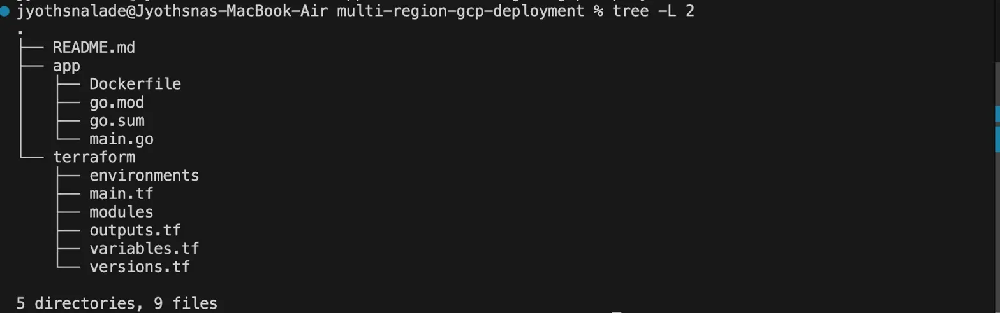
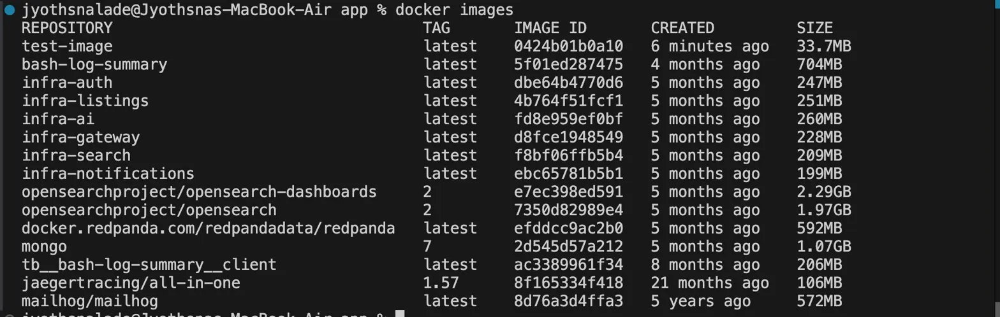
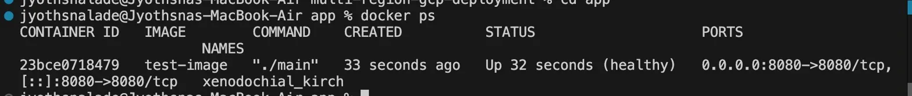
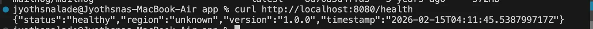

# Multi-region-gcp-deployment
Production-grade multi-region microservice deployment on GCP with Terraform, blue-green deployments, and monitoring

## Architecture

- **Multi-region deployment** across us-central1 and us-east1
- **Infrastructure-as-Code** with Terraform
- **Containerized Go application** with health checks
- **Prometheus metrics** for observability
- **CI/CD pipeline** with GitHub Actions

## Features

- Cloud Run serverless deployment
- Multi-region high availability
- Health and readiness endpoints
- Prometheus metrics exposition
- Blue-green deployment capability
- Infrastructure automation

## Prerequisites

- GCP account with billing enabled
- gcloud CLI installed
- Terraform >= 1.5.0
- Docker installed
- Go >= 1.21


### 1. Set up GCP
```bash
# Set your project ID
export GCP_PROJECT_ID="your-project-id"

# Authenticate
gcloud auth login
gcloud config set project ${GCP_PROJECT_ID}

# Enable APIs
gcloud services enable \
  run.googleapis.com \
  artifactregistry.googleapis.com \
  cloudbuild.googleapis.com
```

### 2. Build and Push Container
```bash
# Configure Docker
gcloud auth configure-docker us-central1-docker.pkg.dev

# Build
cd app
docker build -t us-central1-docker.pkg.dev/${GCP_PROJECT_ID}/multi-region-demo-repo/multi-region-demo:v1.0.0 .

# Push
docker push us-central1-docker.pkg.dev/${GCP_PROJECT_ID}/multi-region-demo-repo/multi-region-demo:v1.0.0
```

### 3. Deploy with Terraform
```bash
cd ../terraform

# Initialize
terraform init

# Plan
terraform plan \
  -var="project_id=${GCP_PROJECT_ID}" \
  -var="image=us-central1-docker.pkg.dev/${GCP_PROJECT_ID}/multi-region-demo-repo/multi-region-demo:v1.0.0"

# Apply
terraform apply \
  -var="project_id=${GCP_PROJECT_ID}" \
  -var="image=us-central1-docker.pkg.dev/${GCP_PROJECT_ID}/multi-region-demo-repo/multi-region-demo:v1.0.0" \
  -auto-approve
```

### 4. Test
```bash
# Get service URLs
terraform output primary_service_url
terraform output secondary_service_url

# Test health endpoint
curl $(terraform output -raw primary_service_url)/health
```

## Endpoints

- `GET /` - Root endpoint with service info
- `GET /health` - Health check endpoint
- `GET /readiness` - Readiness probe
- `GET /info` - Detailed service information
- `GET /metrics` - Prometheus metrics

## Local Development
```bash
cd app
go run main.go

# Test locally
curl http://localhost:8080/health
```
## Project Structure


## Docker Build & Deployment
Docker Image Built Successfully

Container Running with Health Checks

Service Health Check Response



